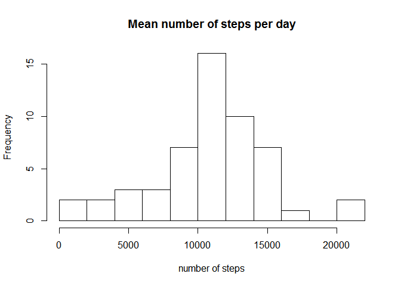
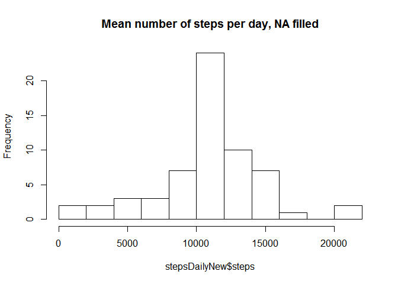
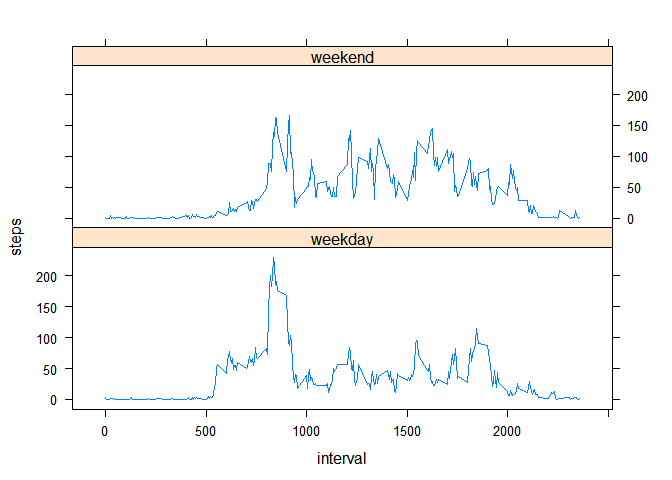

# Reproducible Research: Peer Assessment 1


## Loading and preprocessing the data

Load the activity data:


```r
activity <- read.csv("activity.csv", colClasses = c("integer", "Date", "integer"))
```


## What is mean total number of steps taken per day?


Make a histogram of the total number of steps taken each day:


```r
stepsDaily <- aggregate(steps ~ date, activity, sum)

hist(stepsDaily$steps, main="Mean number of steps per day", xlab="number of steps", breaks=10)
```

 

Calculate and report the mean and median total number of steps taken per day:


```r
mean(stepsDaily$steps)
```

```
## [1] 10766.19
```

```r
median(stepsDaily$steps)
```

```
## [1] 10765
```

## What is the average daily activity pattern?

1. Make a time series plot:


```r
stepsInterval <- aggregate(steps ~ interval, activity, mean)
plot(stepsInterval, type="l")
```

 


2. Which 5-minute interval, on average across all the days in the dataset, contains the maximum number of steps?


```r
stepsInterval$interval[which.max(stepsInterval$steps)]
```

```
## [1] 835
```

It's the 835th interval, and the maximum number of steps it contains is

```r
stepsInterval$steps[which.max(stepsInterval$steps)]
```

```
## [1] 206.1698
```


## Imputing missing values

1. Calculate and report the total number of missing values in the dataset:

```r
sum(is.na(activity))
```

```
## [1] 2304
```

```r
sum(is.na(activity$steps))
```

```
## [1] 2304
```
We can see that all the missing valies in the dataset belong to the "steps" column.
Next step will be filling the missing slots with numeric values.

2. Devise a strategy for filling in all of the missing values in the dataset.

Here we choose to fill the missing values for the steps variable by inserting the mean for the interval where they belong.


3. Create a new dataset that is equal to the original dataset but with the missing data filled in.


```r
activityNew <- activity
for (i in 1:nrow(activityNew)) {
    if (is.na(activityNew$steps[i])) {
        activityNew$steps[i] <- stepsInterval[which(activityNew$interval[i] == stepsInterval$interval), ]$steps
    }
}
```

Check for missing values in the new data set: 

```r
sum(is.na(activityNew))
```

```
## [1] 0
```

4. Make a histogram of the total number of steps taken each day

```r
stepsDailyNew <- aggregate(steps ~ date, activityNew, sum)
hist(stepsDailyNew$steps, main="Mean number of steps per day, NA filled", breaks=10)
```

 

... and Calculate and report the mean and median total number of steps taken per day.


```r
mean(stepsDailyNew$steps)
```

```
## [1] 10766.19
```

```r
median(stepsDailyNew$steps)
```

```
## [1] 10766.19
```


## Are there differences in activity patterns between weekdays and weekends?

1. Create a new factor variable in the dataset with two levels - "weekday" and "weekend" indicating whether a given date is a weekday or weekend  day.


```r
activityNew$dayOfWeek<-factor(format(activityNew$date, "%A"))
levels(activityNew$dayOfWeek)<-list(weekday=c("Monday", "Tuesday", "Wednesday", "Thursday", "Friday"), weekend=c("Saturday", "Sunday"))
```

2. Make a panel plot containing a time series plot


```r
library(lattice)
stepsIntervalNew <- aggregate(steps ~ interval + dayOfWeek, activityNew, mean)
xyplot(steps ~ interval | dayOfWeek, type="l", data=stepsIntervalNew, layout=c(1,2))
```

 
